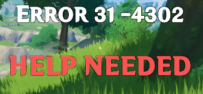
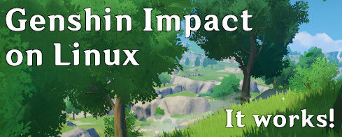
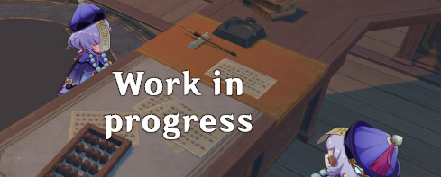

## Game Status v2.6.0

Scroll down for the setup instructions.

<!--  -->

<!--  -->

**Chinese variant:** Available since 2022-02-02

### Explanation

`mhyprot2.sys` is a kernel service which is and will not be supported by Wine. Problem: it's used as cheat prevention.

**Available solutions:**

 * Wine + patched game (what this project does)
 * Dual-boot to Windows
 * [Use Hyper-V in a Windows VM](https://youtu.be/L1JCCdo1bG4?t=191)
 * Play another game. Format: link, caveats (Proton/Wine rating)
    * Blue Protocol, unreleased, 2022 (N/A)
    * Tower of Fantasy, unreleased, 2022 (N/A)
    * [Scarlet Nexus](https://store.steampowered.com/app/775500/SCARLET_NEXUS/), singleplayer (Platinum)
    * [Little Witch Nobeta](https://store.steampowered.com/app/1049890/Little_Witch_Nobeta/) singleplayer (Gold)
    * [Ashen](https://store.steampowered.com/app/649950/Ashen/) (Platinum)
    * [Tower Hunter: Erza's Trial](https://store.steampowered.com/app/844850/Tower_Hunter_Erzas_Trial/) singleplayer, 2D scroller (Platinum)
    * [Haven](https://www.gog.com/game/haven) PEGI 18 (Gold)
    * [Valheim](https://store.steampowered.com/app/892970/Valheim/) no story (Native)
    * [Pine](https://www.gog.com/game/pine) no story, singleplayer (Native)

### Project rules

 1. miHoYo reserves the right to distribute files. Please do not share any game data in public.
 2. For your own sake: **Please do not share this project in public**.
    * Reduces the risk of this project to be taken down or used against our reverse-engineering efforts
    * Solution: Use indirect/redirect links and private messages
 3. Please do not abuse this project for cheating. We just want to play the game.

For project contributors: Beware that your log files may contain personal information, such as MAC addresses or login data.

#### Applying the workaround

See also: **[Full setup instructions](INSTALLATION.md)** (Lutris, Steam, custom)

You will need Wine 5.3 or newer. [DXVK](TROUBLESHOOTING.md#graphics-bugsissues) is highly recommended.

Follow the script as instructed. Backups (.bak) are made automatically where needed.

	# Download the repository (or use the download button)
	git clone https://notabug.org/Krock/dawn --depth 1
	
	cd "/path/to/Genshin Impact Game"
	bash "/path/to/dawn/GAMEVER/patch.sh"
	# Fixes a crash when entering the door or co-op
	bash "/path/to/dawn/GAMEVER/patch_anti_logincrash.sh"

	# Please run "launcher.bat" to start the game
	wine cmd /c launcher.bat

**Undo:** The patch can be reverted using `patch_revert.sh` in the same manner.

### [Troubleshooting](TROUBLESHOOTING.md)

Please **do not report any** game issues to an official channel. Your options are:

 * [Troubleshooting](TROUBLESHOOTING.md) page for common issues and solutions
 * Create a [new issue](https://notabug.org/Krock/dawn/issues) here. See also: [closed/solved issues](https://notabug.org/Krock/dawn/issues?state=closed&labels=2029)
 * Post your problem on a Wine/dxvk-specific page

### [Frequently Asked Questions](FAQ.md)

### [Game updater & patch](updater/)

### [Performance & visual tweaks](TWEAKS.md)

### [Credits](CREDITS.md)

License: MIT
